# IT Operations & Security Playbook

Applied Labs and Operational Knowledge

| Prepared by | Cameron Lowe |
|---|---|
| Certifications | CompTIA A+, Network+, Security+, Project+, CySA+ | ITIL 4 Foundation |
| Focus Areas | IT Operations, SOC Support, IAM, GRC, Encryption |
| Lab Environment | Windows Server 2022 (VMware Fusion), macOS Terminal, Active Directory lab.local |
| Document Version | 3.1 |

This playbook covers applied technical work across IT support, networking, security operations, identity and access management, encryption, and incident response. All seven labs were run in a live environment with documented evidence.

# Lab 1 – Network Discovery and Exposure Analysis (Nmap)

**Objective:** Identify live hosts, open ports, and exposed services to assess network attack surface.

**Tools:** Nmap 7.99, macOS Terminal

**Target:** 192.168.16.132 (LAB-DC01 – Windows Server 2022 Active Directory Domain Controller)

Network scanning is a foundational skill for both IT operations and security assessment. Nmap was used for host discovery, service enumeration, and OS fingerprinting against the lab domain controller, giving a realistic view of the attack surface a Windows AD environment exposes, and feeding directly into the risk register in Lab 7.

## Tool Verification


*Figure 1.1 – Nmap 7.99 installed and verified on macOS analysis platform (cameron-lowe). Compiled with OpenSSL, libssh2, and IPv6 support.*

## Scan 1 – Host Discovery

```
nmap -sn 192.168.16.0/24
Result: 1 live host discovered at 192.168.16.1
256 addresses scanned in 22.03 seconds
```


*Figure 1.2 – Host discovery scan: nmap -sn 192.168.16.0/24 identifies 1 live host on the lab subnet in 22.03 seconds*

## Scan 2 – TCP SYN Scan with Service Detection

```
sudo nmap -sS -sV 192.168.16.132
Open ports discovered:
53/tcp - DNS (Simple DNS Plus)
88/tcp - Kerberos (Microsoft Windows Kerberos)
135/tcp - MSRPC
139/tcp - NetBIOS-SSN
389/tcp - LDAP (Domain: lab.local)
445/tcp - Microsoft-DS (SMB)
3268/tcp - Global Catalog LDAP
5985/tcp - WinRM (HTTP API)
Host: LAB-DC01 | OS: Windows | MAC: 00:0C:29:70:0C:54 (VMware)
```

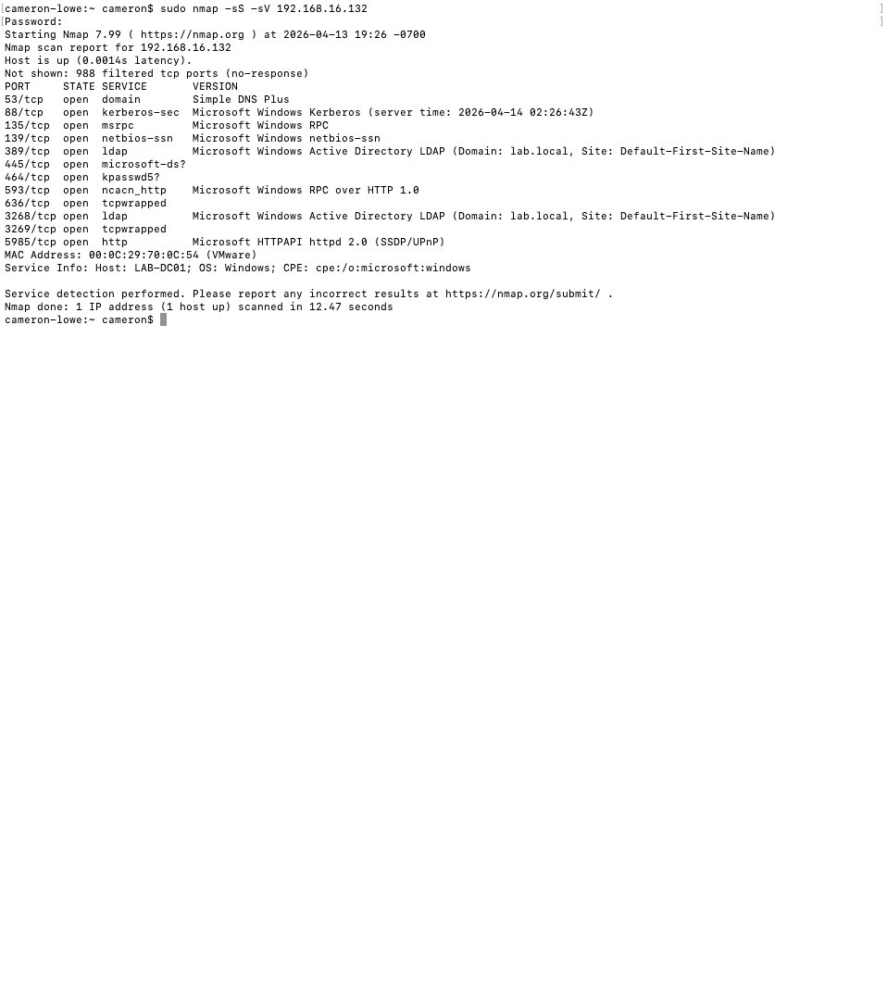

*Figure 1.3 – Service detection scan: 11 open ports identified on LAB-DC01 including Kerberos (88), LDAP (389), SMB (445), and Global Catalog (3268/3269), confirming the Active Directory domain controller role*

## Scan 3 – OS Detection

```
sudo nmap -O 192.168.16.132
OS Detection Result:
Microsoft Windows Server 2022 - 97% confidence
Microsoft Windows 11 21H2 - 91% confidence
Microsoft Windows Server 2016 - 91% confidence
Network Distance: 1 hop
```

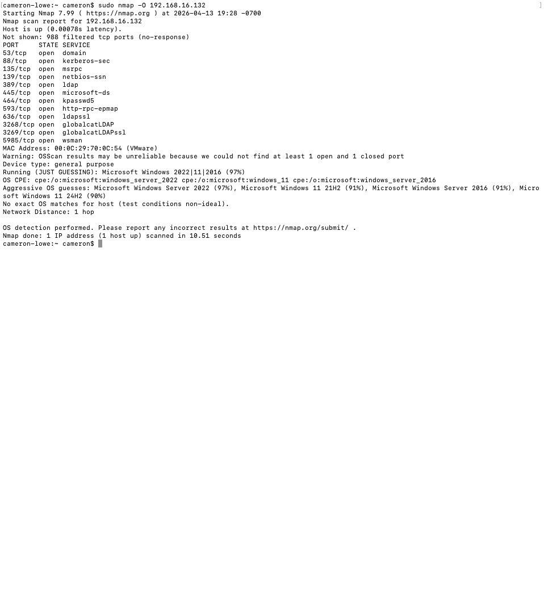

*Figure 1.4 – OS detection scan: target identified as Microsoft Windows Server 2022 at 97% confidence. Network distance of 1 hop confirms direct local network access.*

## Security Findings

| Port / Service | Risk Finding | Recommendation |
|---|---|---|
| 88 – Kerberos | Confirms Active Directory; Kerberoasting attacks target this service | Monitor for SPN enumeration and TGS requests |
| 389 – LDAP | Unencrypted LDAP exposed; credentials can be captured in transit | Enforce LDAPS (636) and disable plain LDAP |
| 445 – SMB | SMB exposure enables lateral movement and ransomware propagation | Restrict SMB to authorized hosts via firewall rules |
| 5985 – WinRM | Remote management enabled; credential attack surface | Restrict WinRM to admin subnets only |
| 3268 – Global Catalog | Confirms DC role; high-value target for domain enumeration | Monitor for unusual LDAP queries against GC |

**NIST Alignment**

| Framework | Control | Description |
|---|---|---|
| NIST CSF | Identify (ID.AM, ID.RA) | Asset discovery and risk assessment through active network scanning |
| NIST SP 800-53 | RA-5 | Vulnerability Monitoring – identify exposed services and assess risk |
| NIST SP 800-53 | CM-7 | Least Functionality – restrict unnecessary open ports and services |

# Lab 2 – Packet Capture and Traffic Analysis (Wireshark)

**Objective:** Analyze network traffic to detect insecure protocols and data exposure risks.

**Tools:** Wireshark 4.6.4, macOS Terminal

**Interface:** en0 (Wi-Fi), live capture

Wireshark was used to capture live network traffic and filter for HTTP sessions. Unencrypted HTTP exposes session data, credentials, and internal host information to any network observer, a direct violation of the data-in-transit protection NIST SP 800-53 SC-8 calls for.

## Tool Verification

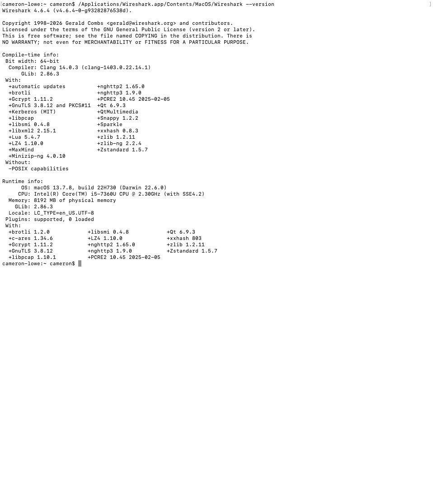

*Figure 2.1 – Wireshark 4.6.4 installed and verified on macOS. Compiled with libpcap 1.10.1, GnuTLS 3.8.12, and libssh2 support.*

## HTTP Traffic Capture

```
Interface: Wi-Fi (en0), live capture
Filter applied: http
Packets captured: 1,598 total | 6 HTTP packets displayed (0.4%)
HTTP sessions observed:
192.168.5.32 → 146.75.42.172 GET /msdownload/update/... HTTP/1.1
146.75.42.172 → 192.168.5.32 HTTP/1.1 304 Not Modified
192.168.5.32 → 34.223.124.45 GET /online/ HTTP/1.1
34.223.124.45 → 192.168.5.32 HTTP/1.1 200 OK (text/html)
```

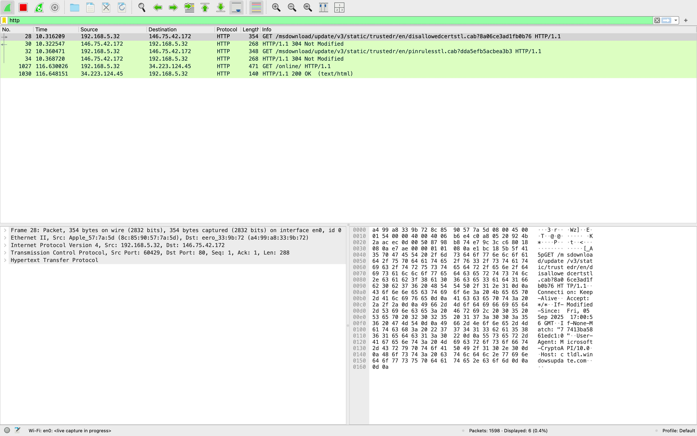

*Figure 2.2 – Wireshark live capture with HTTP filter applied: unencrypted HTTP GET requests and 200 OK responses visible, showing source IP 192.168.5.32, destination IPs, and full packet details including TCP port 80 sessions. Capture active on Wi-Fi en0.*

## Security Findings

| Finding | Risk | Recommendation |
|---|---|---|
| HTTP GET requests captured in cleartext | Request paths, parameters, and headers visible to network observers | Enforce HTTPS, redirect all HTTP to HTTPS, implement HSTS |
| Source/destination IPs visible | Internal host IP (192.168.5.32) exposed in unencrypted traffic | Use TLS to encrypt all application layer data in transit |
| HTTP 200 OK responses with content | Response body contents visible, potential data exposure | Implement TLS 1.2 minimum, disable TLS 1.0/1.1 |

**NIST Alignment**

| Framework | Control | Description |
|---|---|---|
| NIST CSF | Protect (PR.DS), Detect (DE.CM) | Data security and continuous monitoring through traffic analysis |
| NIST SP 800-53 | SC-8 | Transmission Confidentiality and Integrity – enforce encryption for all data in transit |

# Lab 3 – Endpoint Troubleshooting and OS Recovery

**Objective:** Restore a non-booting Windows system and verify file system integrity.

**Tools:** Windows Recovery Environment, Windows Server 2022 (LAB-DC01)

Endpoint recovery is a core IT support skill. This recovery procedure was documented on the Windows Server 2022 VM (LAB-DC01) to show proficiency with Windows recovery tooling for environments where boot record integrity is compromised. No actual corruption was present; the procedure documents the response process for when it is.

## Recovery Procedure

```
# System File Checker – scan and repair protected system files
sfc /scannow

# Check Disk – scan for file system errors and bad sectors
chkdsk C: /f /r

# Boot Record Repair (run from Recovery Environment)
bootrec /fixmbr       # Repair Master Boot Record
bootrec /fixboot      # Write new boot sector
bootrec /rebuildbcd   # Rebuild Boot Configuration Data
```

## Windows Update – Patch Management Baseline

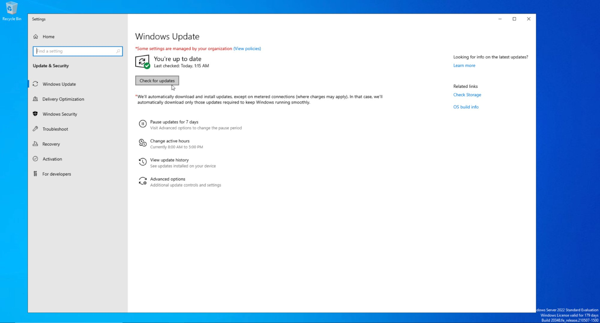

*Figure 3.1 – Windows Server 2022 fully patched: Windows Update confirms system up to date. Patch management baseline established on LAB-DC01 prior to AD DS deployment.*

| Recovery Tool | Purpose | When Used |
|---|---|---|
| sfc /scannow | Scans and repairs corrupted Windows system files | System instability, missing OS files |
| chkdsk /f /r | Finds and fixes file system errors and bad sectors | Disk errors, filesystem corruption |
| bootrec /fixmbr | Repairs the Master Boot Record | OS fails to boot, MBR corruption |
| bootrec /fixboot | Writes a new boot sector to the system partition | Boot sector damaged or missing |
| bootrec /rebuildbcd | Scans for Windows installations and rebuilds the BCD store | Boot Configuration Data corruption |

**NIST Alignment**

| Framework | Control | Description |
|---|---|---|
| NIST CSF | Protect (PR.IP), Recover (RC.RP) | Information protection and recovery planning through documented procedures |
| NIST SP 800-53 | CP-10 | System Recovery and Reconstitution – restore systems to a known good state |
| NIST SP 800-53 | SI-7 | Software, Firmware, and Information Integrity – verify system file integrity |

# Lab 4 – Identity and Access Management (Active Directory)

**Objective:** Deploy Active Directory Domain Services, enforce least privilege through RBAC, and implement enterprise-grade password and lockout policies.

**Tools:** Windows Server 2022, AD DS, ADUC, Group Policy Management Editor

**Domain:** lab.local | DC: LAB-DC01 | IP: 192.168.16.132

## Phase 1 – AD DS Role Installation

The AD DS role was added through Server Manager on LAB-DC01, including Group Policy Management, Remote Server Administration Tools, AD DS snap-ins, and the Active Directory module for Windows PowerShell.

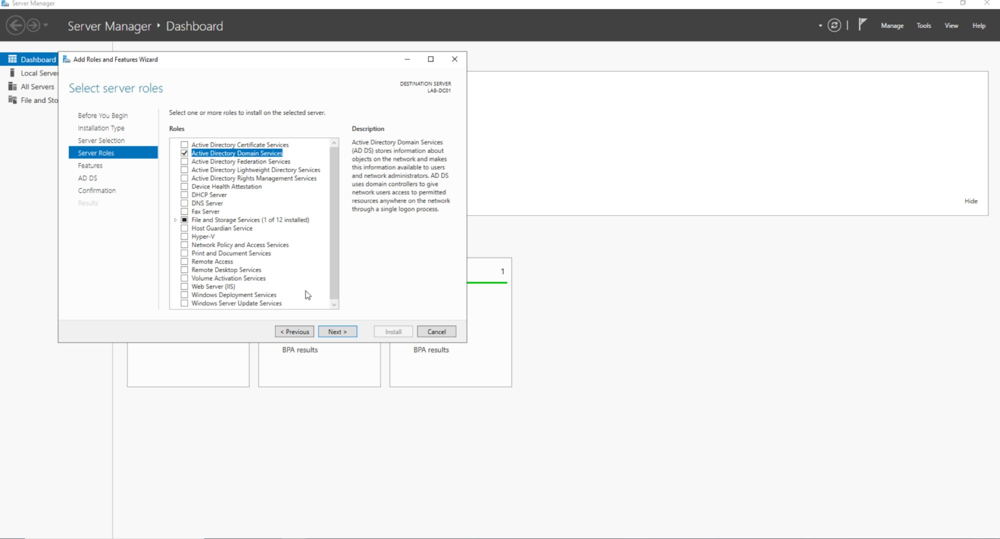

*Figure 4.1 – Server Manager: Active Directory Domain Services role selected for installation on LAB-DC01 alongside Group Policy Management and AD DS administrative tools*

## Phase 2 – Domain Controller Promotion

LAB-DC01 was promoted to a domain controller for a new forest (lab.local). The promotion integrated DNS and confirmed all three roles active: AD DS, DNS, and File and Storage Services.

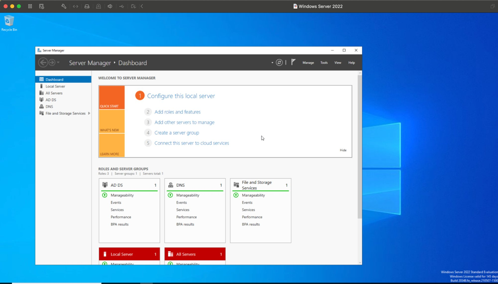

*Figure 4.2 – Server Manager Dashboard: successful DC promotion confirmed, AD DS, DNS, and File and Storage Services roles all active and healthy on LAB-DC01*

## Phase 3 – Organizational Unit Structure

Two OUs were created within lab.local to enforce segmented access control: IT_Staff for privileged personnel and Help_Desk for lower-privilege support staff.


*Figure 4.3 – Active Directory Users and Computers: lab.local domain showing Help_Desk and IT_Staff Organizational Units alongside default containers*

## Phase 4 – RBAC Group Assignment

Security groups were created in each OU and users assigned to enforce role-based access control. John Smith (jsmith) was assigned to IT_Staff with elevated access. Jane Doe (jdoe) was assigned to HD_ReadOnly with least-privilege, read-only access.

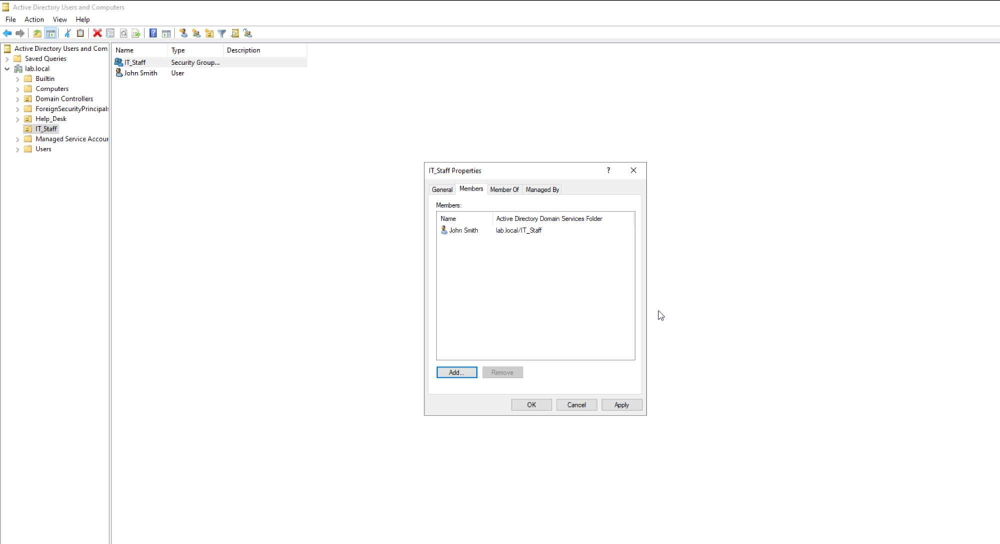

*Figure 4.4 – IT_Staff group properties: John Smith (lab.local/IT_Staff) assigned as member, elevated IT access role*

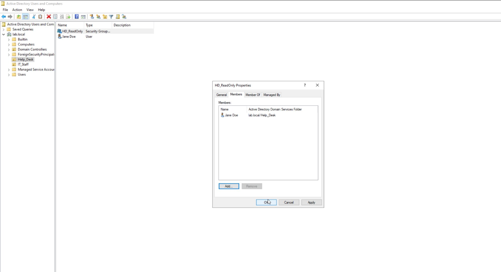

*Figure 4.5 – HD_ReadOnly group properties: Jane Doe (lab.local/Help_Desk) assigned as member, least-privilege read-only access role*

## Phase 5 – Password and Lockout Policy

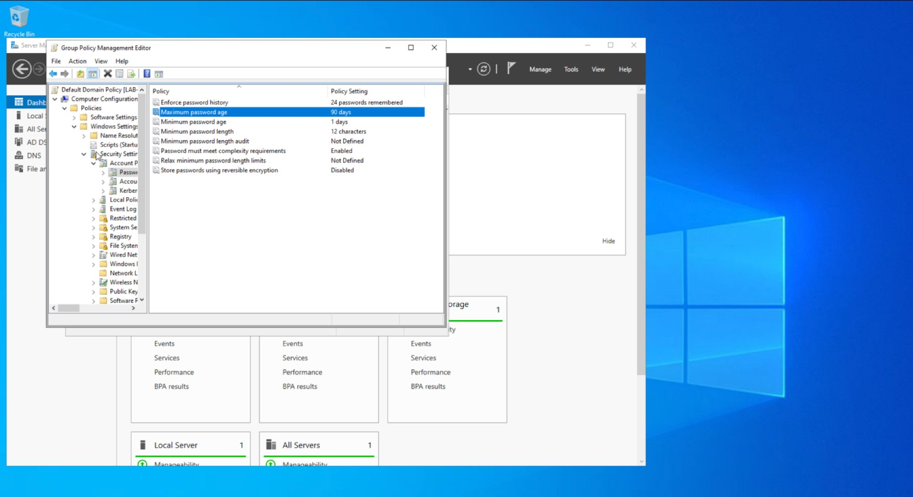

*Figure 4.6 – Group Policy Management Editor: password policy, 12-character minimum, complexity enabled, 90-day maximum age, 24-password history enforced domain-wide*


*Figure 4.7 – Group Policy Management Editor: account lockout policy, 5 invalid attempts, 10-minute lockout duration, automatic counter reset*

| Policy Setting | Value | Security Rationale |
|---|---|---|
| Minimum Password Length | 12 characters | Reduces brute-force attack surface |
| Password Complexity | Enabled | Requires mixed character types |
| Maximum Password Age | 90 days | Limits credential exposure window |
| Password History | 24 passwords remembered | Prevents reuse of recent passwords |
| Account Lockout Threshold | 5 invalid attempts | Blocks brute-force attacks |
| Lockout Duration | 10 minutes | Auto-recovery reduces helpdesk burden |

**NIST Alignment**

| Framework | Control | Description |
|---|---|---|
| NIST CSF | Protect (PR.AC) | Identity management and access control through AD DS RBAC and GPO |
| NIST SP 800-53 | AC-2 | Account Management – all accounts provisioned with defined roles and group membership |
| NIST SP 800-53 | AC-6 | Least Privilege – HD_ReadOnly group restricts access to minimum necessary permissions |
| NIST SP 800-53 | IA-5 | Authenticator Management – password complexity and rotation enforced via GPO |

# Lab 5 – Encryption at Rest and In Transit (GPG)

**Objective:** Protect sensitive data using asymmetric encryption at rest.

**Tools:** GPG (GnuPG/MacGPG2) 2.2.41, macOS Terminal

**Algorithm:** RSA 3072-bit key pair | Key ID: E05B8E49E82BB264

GPG implements the OpenPGP standard for asymmetric encryption. A key pair was generated for Cameron Lowe, a test file with sensitive data was encrypted using the public key, verified as a PGP-encrypted binary, and decrypted successfully using the private key, demonstrating end-to-end data protection at rest as an alternative to insecure methods like FTP or unencrypted email attachments.

## Step 1 – GPG Version Verification


*Figure 5.1 – GPG (GnuPG/MacGPG2) 2.2.41 verified on macOS. Supported algorithms include RSA, AES256, SHA256, and SHA512.*

## Step 2 – RSA Key Pair Generation

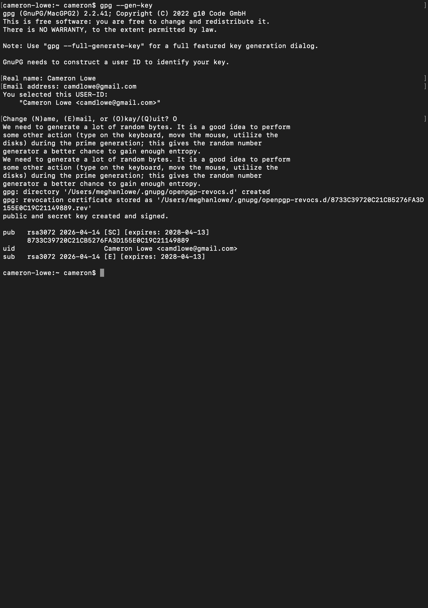

*Figure 5.2 – RSA 3072-bit key pair generated for Cameron Lowe (camdlowe@gmail.com). Public and private keys created and signed. Key expires 2028-04-13. Revocation certificate stored.*

## Step 3 – Test File Creation

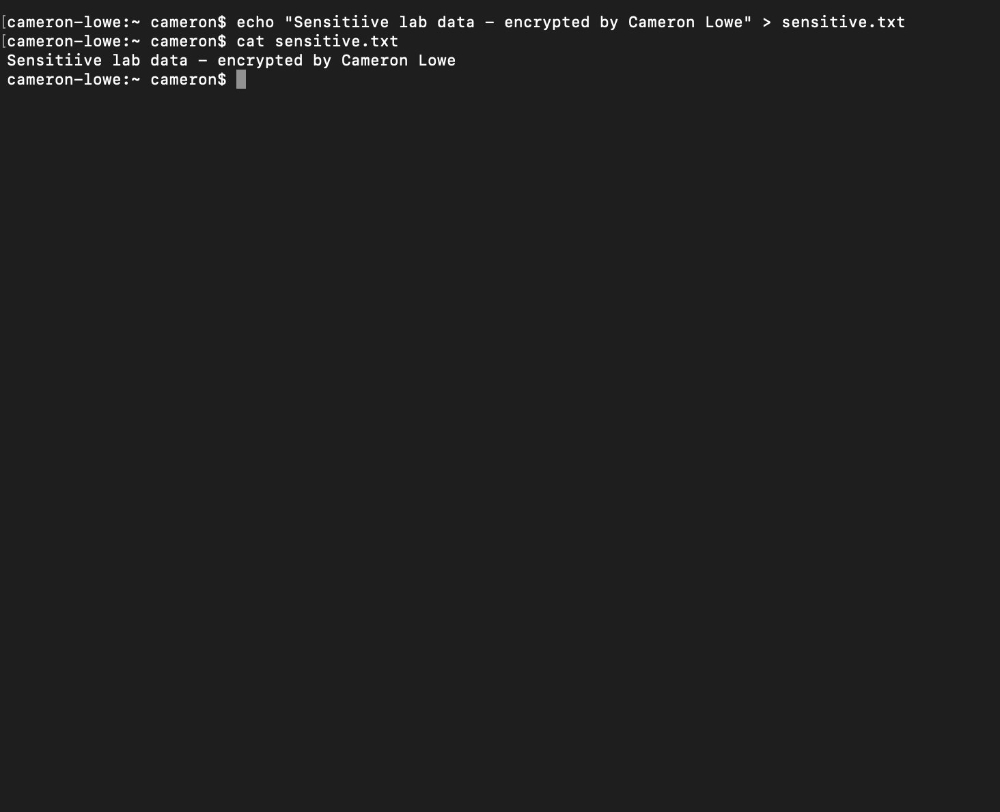

*Figure 5.3 – sensitive.txt created with plaintext content: "Sensitive lab data – encrypted by Cameron Lowe." File contents verified with cat before encryption.*

## Step 4 – File Encryption

```
gpg --output sensitive.gpg --encrypt --recipient camdlowe@gmail.com sensitive.txt

Result: sensitive.gpg created
Trust model: PGP | Depth: 0 | Valid keys: 1
Next trustdb check: 2028-04-13
```

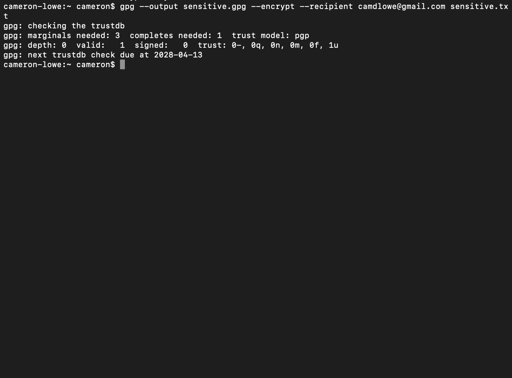

*Figure 5.4 – Encryption successful: sensitive.txt encrypted to sensitive.gpg using the RSA public key for camdlowe@gmail.com. Trust database verified.*

## Step 5 – Verification and Decryption

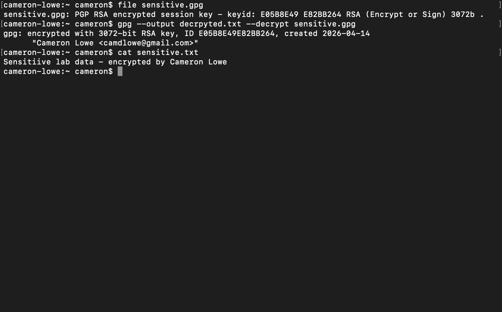

*Figure 5.5 – Full encryption cycle verified: sensitive.gpg confirmed as "PGP RSA encrypted session key, keyid E05B8E49E82BB264 RSA 3072b." Decryption successful using the private key; plaintext restored and verified with cat.*

| Step | Command | Result |
|---|---|---|
| Key generation | gpg --gen-key | RSA 3072-bit key pair created for Cameron Lowe |
| File creation | echo '...' > sensitive.txt | Plaintext test file created and verified |
| Encryption | gpg --output sensitive.gpg --encrypt --recipient ... | File encrypted using RSA public key |
| Verification | file sensitive.gpg | Confirmed PGP RSA encrypted, unreadable without the private key |
| Decryption | gpg --output decrypted.txt --decrypt sensitive.gpg | Original plaintext restored, encryption integrity confirmed |

**NIST Alignment**

| Framework | Control | Description |
|---|---|---|
| NIST CSF | Protect (PR.DS) | Data security, sensitive data encrypted at rest using asymmetric cryptography |
| NIST SP 800-53 | SC-12 | Cryptographic Key Establishment – RSA key pair generated and managed |
| NIST SP 800-53 | SC-13 | Cryptographic Protection – AES256/RSA3072 encryption applied to sensitive data |
| NIST SP 800-53 | SC-28 | Protection of Information at Rest – data encrypted before storage or transfer |

# Lab 6 – Incident Response Simulation

**Objective:** Practice structured incident handling using the NIST SP 800-61 lifecycle.

**Tools:** Windows Server 2022 VM, Windows Event Viewer, Task Manager, Registry Editor, VM Snapshot

**Scenario:** Simulated ransomware infection, tabletop exercise

This lab works through a simulated ransomware infection using the NIST SP 800-61 lifecycle: Preparation, Detection and Analysis, Containment, Eradication, Recovery, and Post-Incident Activity, run as a structured tabletop against the LAB-DC01 environment.

## Incident Response Timeline

| Phase | Action Taken | Tool Used | Time (T+) |
|---|---|---|---|
| Identification | Anomalous process detected in running processes and event logs | Event Viewer / Task Manager | T+0 |
| Containment | Host isolated by disabling the VM network adapter to prevent lateral movement | VM network settings | T+10 min |
| Eradication | Malicious process terminated; registry Run keys inspected for persistence | Task Manager, Registry Editor | T+25 min |
| Recovery | Clean VM snapshot restored; system integrity verified post-restore | VM Snapshot Manager | T+45 min |
| Lessons Learned | Gaps documented: no EDR, no centralized logging; remediation plan drafted | Written report | T+60 min |

## Lessons Learned

| Gap Identified | Risk | Remediation |
|---|---|---|
| No endpoint EDR solution | Malicious processes not automatically detected or blocked | Deploy EDR with behavioral detection capability |
| No centralized SIEM logging | Incident timeline reconstruction difficult without central logs | Implement SIEM, forward and alert on Windows Event logs |
| Manual containment required | Network isolation took 10 minutes; an attacker would have that time to move laterally | Automate containment via an EDR playbook or SOAR |
| VM snapshot not on a regular schedule | Recovery point could be outdated in production | Automated daily snapshots with a retention policy |

**NIST Alignment**

| Framework | Control | Description |
|---|---|---|
| NIST CSF | Respond (RS), Recover (RC) | Structured incident response and recovery aligned to NIST SP 800-61 |
| NIST SP 800-53 | IR-4 | Incident Handling – detect, contain, eradicate, and recover from incidents |
| NIST SP 800-53 | IR-8 | Incident Response Plan – documented procedure following defined lifecycle phases |
| NIST SP 800-53 | CP-10 | System Recovery – clean state restoration via VM snapshot |

# Lab 7 – Risk Assessment and Documentation

**Objective:** Translate technical findings into business risk language for governance and decision-making.

The risk register below consolidates findings from Labs 1 through 6 into a governance-ready document. Each risk is assessed for likelihood and impact, existing controls are documented, and specific mitigations are recommended, the kind of GRC documentation relevant to analyst and compliance roles.

## Risk Register

| Risk | Likelihood | Impact | Current Control | Mitigation | Owner |
|---|---|---|---|---|---|
| RDP (3389) exposed externally | High | High | None | Restrict to VPN/jump host only | IT Ops |
| LDAP (389) unencrypted | High | High | None | Enforce LDAPS (636), disable plain LDAP | IAM Team |
| SMB (445) exposed on DC | High | High | Network segmentation | Restrict via firewall to authorized hosts | IT Ops |
| HTTP traffic unencrypted | Medium | Medium | None | Enforce TLS, implement HSTS | IT Ops |
| No endpoint EDR | Medium | High | Windows Defender | Evaluate and deploy EDR solution | Security Ops |
| No centralized SIEM | High | High | Windows Event Logs local | Deploy SIEM, forward all logs | Security Ops |
| Weak password policy (pre-GPO) | Medium | High | None | GPO enforced: 12+ char + MFA | IAM Team |
| Undetected lateral movement | Medium | High | Subnet segmentation | Deploy NACLs, implement EDR | Security Ops |

**NIST Alignment**

| Framework | Control | Description |
|---|---|---|
| NIST CSF | Identify (ID.RA) | Risk assessment, threat scenarios mapped to existing controls and mitigations |
| NIST SP 800-53 | RA-3 | Risk Assessment – likelihood, impact, and mitigation documented for each risk |
| NIST SP 800-53 | PM-9 | Risk Management Strategy – risk register maintained, prioritized, and tracked |

# IT Service Management & Governance (ITIL 4)

ITIL 4 service management principles run through this playbook to keep technical activities governed, documented, and tied to business value. The Service Value System (SVS) is the governance structure that connects all the lab activities.

## Service Value Chain Mapping

| SVS Activity | Playbook Mapping |
|---|---|
| Plan | Risk assessments, access reviews, change evaluation (Labs 1, 7) |
| Improve | Continual improvement register and post-incident reviews (Lab 6) |
| Engage | Incident intake and stakeholder communication (Lab 6) |
| Design & Transition | Secure system and access design (Labs 4, 5) |
| Obtain / Build | Tool configuration and system hardening (Labs 1, 2, 3, 4) |
| Deliver & Support | Endpoint support and incident response (Labs 3, 6) |

## Continual Improvement Register

| Improvement | Current State | Target State | Owner | Status |
|---|---|---|---|---|
| Enforce LDAPS on DC | Plain LDAP (389) open | LDAPS only (636) | IAM Team | Planned |
| Deploy centralized SIEM | Local Windows Event Logs only | Splunk ingesting all sources | Security Ops | In Progress |
| Implement MFA for AD accounts | Password-only auth | MFA enforced domain-wide | IAM Team | Planned |
| Enable host-based EDR | Windows Defender only | EDR with central management | Security Ops | Planned |
| Restrict SMB via firewall | SMB open on network | SMB restricted to authorized hosts | IT Ops | Planned |

# Framework Alignment Summary

| Framework | Role in This Playbook |
|---|---|
| NIST CSF | Security risk management across all five functions: Identify, Protect, Detect, Respond, Recover |
| NIST SP 800-53 | Specific control references per lab: AC, AU, CA, CM, CP, IA, IR, PM, RA, SC, SI controls |
| ITIL 4 | Service management governance, SVS mapping, change records, continual improvement register |
| MITRE ATT&CK | Threat context for Lab 1 findings, T1046 (Network Service Scanning), T1110 (Brute Force) |
| CIS Controls | Lab 4 password/lockout policy aligns to CIS Control 5 (Account Management) |
| CompTIA A+ / N+ / S+ | Technical execution competencies demonstrated through live lab evidence |

**Playbook Completion Statement**

*All seven labs were run in a live environment and documented with real evidence: network scans, packet captures, encryption operations, Active Directory configuration, and incident response procedures, all supported by screenshots and command output.*
