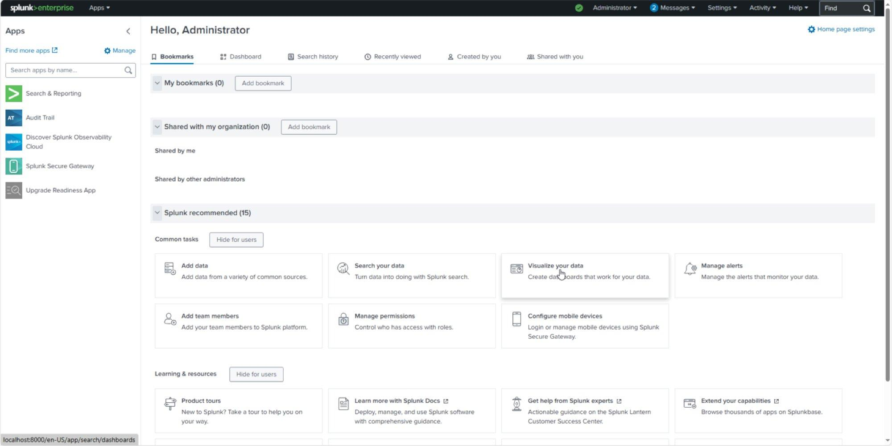
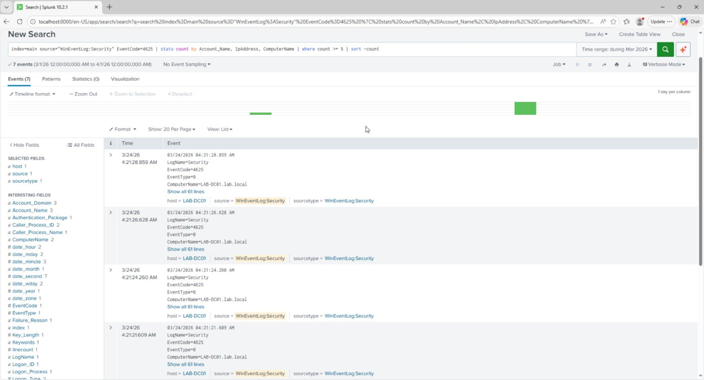
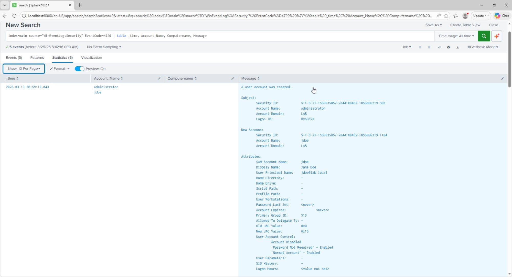
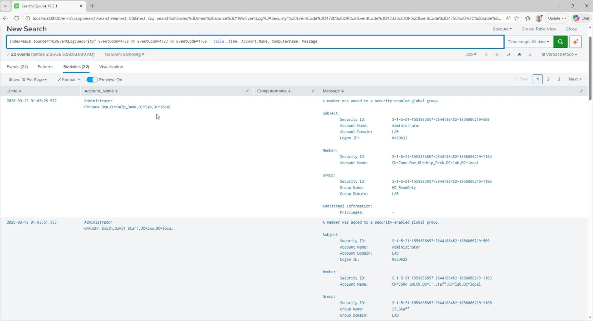
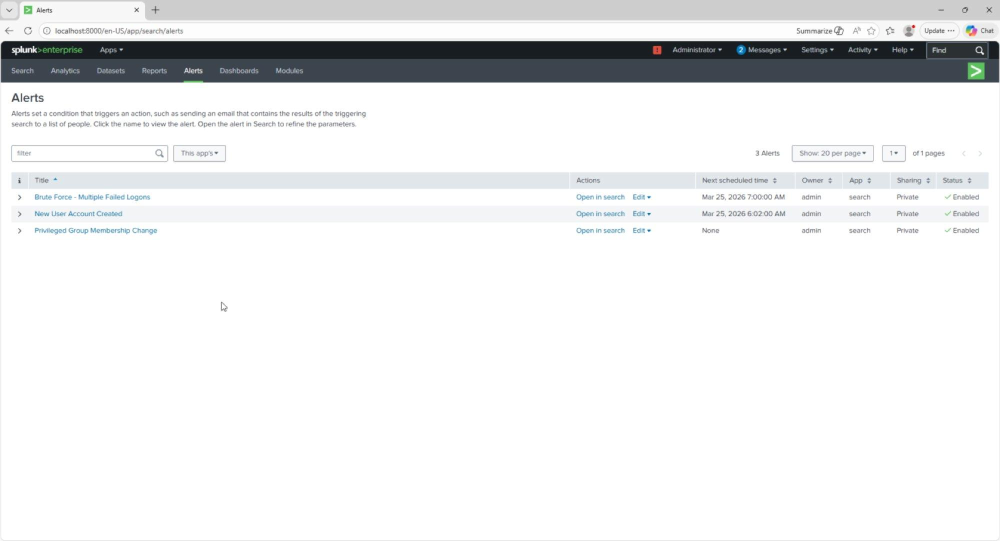
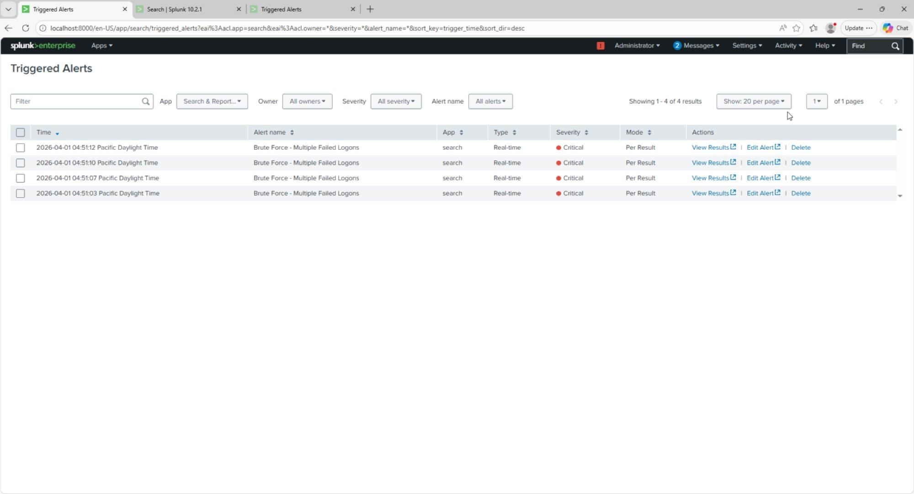

# SIEM Home Lab

Splunk Enterprise – Threat Detection & Alert Engineering

| Prepared by | Cameron Lowe |
|---|---|
| SIEM Platform | Splunk Enterprise 10.2.1 |
| Log Source | Windows Server 2022 – Active Directory Domain Controller (LAB-DC01.lab.local) |
| Detection Rules | 3 custom alerts – Brute Force, New User Account, Privileged Group Change |
| Framework Alignment | NIST CSF · NIST SP 800-53 · MITRE ATT&CK |
| Validation | Live triggered alerts confirmed in Splunk Activity log |
| Document Version | 1.1 |

This lab book covers building a functional home SIEM environment. All detections use real Windows Security event logs from an Active Directory domain controller, tested against live simulations and validated through Splunk's triggered alerts pipeline.

## Overview & Lab Architecture

Using Splunk Enterprise installed directly on an Active Directory domain controller, Windows Security event logs were ingested and used to build three detection rules aligned to real SOC use cases.

| Component | Technology | Detail |
|---|---|---|
| SIEM Platform | Splunk Enterprise 10.2.1 | Installed on LAB-DC01, accessible via localhost:8000 |
| Log Source | Windows Security Event Log | WinEventLog:Security, ingested via local event log collection |
| Domain | Active Directory – lab.local | Domain controller LAB-DC01 generating authentication and IAM events |
| Detection Rules | 3 SPL-based alerts | Brute Force, New User Account, Privileged Group Membership Change |
| Validation | Live triggered alerts | Real-time alerts confirmed firing in Splunk Activity log |

**Why these detections:** failed logon monitoring covers credential-based attacks (MITRE T1110), account creation monitoring covers persistence (T1136), and group membership monitoring covers privilege escalation (T1098). All three are among the highest-frequency alert categories in enterprise SOC environments.

## Phase 1 – Environment Setup

Splunk Enterprise 10.2.1 was installed on the Windows Server 2022 domain controller (LAB-DC01). Using the existing AD infrastructure, already configured with Organizational Units, user accounts, and security groups, as the log source meant authentication, account management, and group membership events were available from the first moment of operation.

### Splunk Installation

| Step | Action | Outcome |
|---|---|---|
| 1 | Downloaded Splunk Enterprise 10.2.1 Windows 64-bit .msi | Installer file confirmed via Splunk download portal |
| 2 | Ran installer, accepted license, default path C:\Program Files\Splunk | Splunk Enterprise installed successfully |
| 3 | Splunk service started automatically post-install | Web UI accessible at http://localhost:8000 |
| 4 | Logged in as Administrator | Splunk Enterprise home dashboard confirmed operational |
| 5 | Added Windows Security log via Settings → Add Data → Monitor → Local Event Logs | WinEventLog:Security input created successfully |



*Figure 1.1 – Splunk Enterprise 10.2.1 home dashboard: Administrator logged in, Search & Reporting and Audit Trail apps active, running at localhost:8000 on LAB-DC01*

### Log Source Verification

A verification search confirmed Windows Security events were flowing into Splunk from LAB-DC01. Event codes observed immediately included 4624 (successful logon), 4634 (logoff), and 4672 (special privileges assigned to new logon), all high-value authentication events.

```
SPL Verification Search:
index=main source="WinEventLog:Security" | head 20

Result: 20 events returned from LAB-DC01.lab.local
Event codes observed: 4624 (Logon), 4634 (Logoff), 4672 (Privilege use)
```

**Phase 1 – NIST Alignment**

| Framework | Control | Description |
|---|---|---|
| NIST CSF | Identify (ID.AM) | Asset management – log source identified and ingestion confirmed |
| NIST SP 800-53 | AU-2 | Audit Events – Windows Security log selected as primary audit source |
| NIST SP 800-53 | SI-4 | System Monitoring – SIEM operational, continuous log ingestion active |

## Detection 1 – Brute Force / Multiple Failed Logons

**MITRE ATT&CK:** T1110 – Brute Force | **Severity:** Critical | **Alert Type:** Real-time, Per Result

Windows Security EventCode 4625 fires on every failed logon attempt, whether or not the account exists, which makes it one of the more reliable indicators of a credential-based attack.

### Live Alert Query

The working alert uses a simple per-event match so it fires in real time on each occurrence:

```
index=main source="WinEventLog:Security" EventCode=4625
```

Alert type: Real-time, Per Result, so it fires on every matching event rather than waiting for an aggregation window to close.

### Investigation Query (threshold analysis)

For manually reviewing which accounts are taking the most failures, a separate stats-based search is more useful, but it's a search, not the alert itself:

```
index=main source="WinEventLog:Security" EventCode=4625
| stats count by Account_Name, IpAddress, ComputerName
| where count >= 5
| sort -count
```

This groups failed logons by account and source IP and surfaces anything with 5+ failures as a priority investigation target. It's not compatible with real-time per-result alerting (see Lessons Learned below), which is why the live alert itself uses the simpler per-event query above and this one stays a manual/scheduled search.

### Test & Validation

A controlled brute force simulation entered incorrect credentials for the domain account jsmith multiple times from the LAB-DC01 console. This generated 7 EventCode 4625 events within seconds, confirming the detection pipeline was capturing failed authentication activity from the domain controller.



*Figure 2.1 – Brute force detection results: 7 EventCode 4625 failed logon events captured from LAB-DC01.lab.local during the controlled simulation. Event fields include Account_Name, ComputerName, and Failure_Reason.*

### Alert Configuration

```
Alert Name: Brute Force - Multiple Failed Logons
Alert Type: Real-time
Trigger: Per Result (fires on every 4625 event)
Severity: Critical
Action: Add to Triggered Alerts
Description: Fires on every failed logon attempt (EventCode 4625).
Sustained volume against one account or from one source IP indicates
brute force or password spray activity. Maps to MITRE ATT&CK T1110.
```

| Event Field | Value Observed | Significance |
|---|---|---|
| EventCode | 4625 | Windows failed logon, a universal brute force indicator |
| Account_Name | jsmith | Target account under attack |
| ComputerName | LAB-DC01.lab.local | Domain controller receiving authentication requests |
| Failure_Reason | Unknown user name or bad password | Credential failure confirmed |
| LogName | Security | Windows Security audit log, highest fidelity source |

**Detection 1 – NIST & MITRE Alignment**

| Framework | Control | Description |
|---|---|---|
| MITRE ATT&CK | T1110 – Brute Force | Password guessing and spraying against domain accounts |
| NIST CSF | Detect (DE.CM) | Continuous monitoring, real-time alert on every failed logon |
| NIST SP 800-53 | AC-7 | Unsuccessful Logon Attempts – detect and respond to repeated failures |
| NIST SP 800-53 | SI-4 | System Monitoring – automated alerting on anomalous authentication events |

## Detection 2 – New User Account Created

**MITRE ATT&CK:** T1136 – Create Account | **Severity:** High | **Alert Type:** Real-time, Per Result

Windows Security EventCode 4720 fires whenever a new user account is created in Active Directory, a common persistence technique for maintaining access after an initial compromise. This detection fires in real time on every account creation event.

### SPL Detection Query

```
index=main source="WinEventLog:Security" EventCode=4720
| table _time, Account_Name, ComputerName, Message
```

Returns all new account creation events with full AD attributes: SAM Account Name, Display Name, UPN, and the creating administrator.

### Evidence – Account Creation Events

The detection returned 5 account creation events from the AD lab environment. The most significant entry documents the creation of jdoe (Jane Doe) in the lab.local/Help_Desk OU by the Administrator account, with full attribution: Security ID, UPN (jdoe@lab.local), Display Name, and UAC flags confirming account configuration.



*Figure 3.1 – New user account detection results: EventCode 4720 showing jdoe (Jane Doe) created in lab.local/Help_Desk by Administrator. Full AD attributes captured including UPN jdoe@lab.local, Security ID, and account control flags.*

### Alert Configuration

```
Alert Name: New User Account Created
Alert Type: Real-time
Trigger: Per Result (fires on every account creation)
Severity: High
Action: Add to Triggered Alerts
Description: Fires whenever a new user account is created in Active
Directory, for immediate review of whether the creation was authorized.
```

| Event Field | Value Observed | Significance |
|---|---|---|
| EventCode | 4720 | New user account created, a persistence indicator |
| Account_Name | jdoe | Newly created account's SAM name |
| Display Name | Jane Doe | Full name of the created account |
| User Principal Name | jdoe@lab.local | Domain UPN, confirms a domain account rather than local |
| Subject Account | Administrator | Who created the account, for the audit trail |
| New UAC Value | 0x15 – Normal Account | Account type and status flags |

**Detection 2 – NIST & MITRE Alignment**

| Framework | Control | Description |
|---|---|---|
| MITRE ATT&CK | T1136 – Create Account | Adversary creates accounts to maintain persistence post-compromise |
| NIST CSF | Detect (DE.CM) | Continuous monitoring, real-time alert on every account creation |
| NIST SP 800-53 | AC-2 | Account Management – all account creation events reviewed and audited |
| NIST SP 800-53 | AU-9 | Protection of Audit Information – creation events captured with full attribution |

## Detection 3 – Privileged Group Membership Change

**MITRE ATT&CK:** T1098 – Account Manipulation | **Severity:** High | **Alert Type:** Real-time, Per Result

Windows Security EventCodes 4728, 4732, and 4756 capture additions to security-enabled global, local, and universal groups. Adding a compromised account to a high-privilege group is a common way to escalate access without creating a new account, so this detection covers all three event codes and alerts on any group membership change in real time.

### SPL Detection Query

```
index=main source="WinEventLog:Security"
EventCode=4728 OR EventCode=4732 OR EventCode=4756
| table _time, Account_Name, ComputerName, Message
```

4728 = member added to a security-enabled global group. 4732 = local group. 4756 = universal group.

### Evidence – Group Membership Changes

The detection returned 22 events capturing all group membership changes made during the AD lab. Two entries document the RBAC assignments: Jane Doe (CN=Jane Doe,OU=Help_Desk,DC=lab,DC=local) added to HD_ReadOnly, and John Smith (CN=John Smith,OU=IT_Staff,DC=lab,DC=local) added to IT_Staff. Both actions were performed by the Administrator account, giving a full audit trail linking the RBAC design to specific security events.



*Figure 4.1 – Privileged group membership detection results: 22 events showing Jane Doe added to HD_ReadOnly and John Smith added to IT_Staff by Administrator. Full group DN and member DN captured.*

### Alert Configuration

```
Alert Name: Privileged Group Membership Change
Alert Type: Real-time
Trigger: Per Result (fires on every group membership change)
Severity: High
Action: Add to Triggered Alerts
Description: Fires on any privileged group membership change, to
detect potential privilege escalation via group manipulation.
```

| Event Field | Value Observed | Significance |
|---|---|---|
| EventCode | 4728 | Member added to a security-enabled global group |
| Member | CN=Jane Doe,OU=Help_Desk,DC=lab | Full DN of the account added to the group |
| Group Name | HD_ReadOnly / IT_Staff | Target security group, RBAC enforcement |
| Group Domain | LAB | Domain context, confirms a domain group modification |
| Subject | Administrator | Actor performing the group change, full attribution |

**Detection 3 – NIST & MITRE Alignment**

| Framework | Control | Description |
|---|---|---|
| MITRE ATT&CK | T1098 – Account Manipulation | Modifying group membership to escalate privileges post-compromise |
| NIST CSF | Detect (DE.CM) | Continuous monitoring, real-time alert on group membership changes |
| NIST SP 800-53 | AC-6 | Least Privilege – any deviation from expected group membership flagged immediately |
| NIST SP 800-53 | AC-2 | Account Management – group changes audited with full subject attribution |

## Alert Summary & Live Validation

### All Three Alerts – Active and Enabled

The Splunk Alerts dashboard confirms all three detection rules are saved, enabled, and running in real-time mode.



*Figure 5.1 – Splunk Alerts dashboard: all 3 detection rules confirmed active, Brute Force - Multiple Failed Logons, New User Account Created, and Privileged Group Membership Change. Status: Enabled for all.*

### Live Triggered Alerts – End-to-End Validation

To confirm the full pipeline was operational, a controlled brute force simulation ran against domain account jsmith. The Brute Force alert fired 4 times in real time within seconds, one triggered alert per failed logon attempt. All alerts correctly reported Critical severity and Per Result mode, confirming the pipeline works from Windows event generation through Splunk indexing to alert firing.



*Figure 5.2 – Triggered Alerts dashboard: 4 live Brute Force alerts fired April 1, 2026 between 04:51:03 and 04:51:12 Pacific Time. Severity: Critical. Type: Real-time. Mode: Per Result.*

| Alert | Trigger Event | Mode | Severity | Validated |
|---|---|---|---|---|
| Brute Force - Multiple Failed Logons | EventCode 4625 – failed domain logon | Real-time / Per Result | Critical | 4 live triggers confirmed |
| New User Account Created | EventCode 4720 – AD account creation | Real-time / Per Result | High | 5 historical events captured |
| Privileged Group Membership Change | EventCode 4728/4732/4756 – group modification | Real-time / Per Result | High | 22 historical events captured |

## Framework Alignment Summary

### MITRE ATT&CK Coverage

| Technique | ID | Detection | Coverage |
|---|---|---|---|
| Brute Force | T1110 | Detection 1 – EventCode 4625 | Real-time alert on every failed logon |
| Create Account | T1136 | Detection 2 – EventCode 4720 | Real-time alert on every AD account creation |
| Account Manipulation | T1098 | Detection 3 – EventCodes 4728/4732/4756 | Real-time alert on group membership changes |

### NIST SP 800-53 Control Coverage

| Control | Title | How This Lab Satisfies It |
|---|---|---|
| AC-2 | Account Management | All account creations and group changes logged and alerted |
| AC-6 | Least Privilege | Group membership changes monitored to detect privilege escalation |
| AC-7 | Unsuccessful Logon Attempts | Failed logons alerted in real time with full account attribution |
| AU-2 | Audit Events | Windows Security log ingested as the primary audit source |
| AU-6 | Audit Review | Automated alerting replaces manual log review for high-risk events |
| SI-4 | System Monitoring | Continuous real-time SIEM monitoring across all three detection categories |
| CA-7 | Continuous Monitoring | Live triggered alerts confirm ongoing detection capability |

## Lessons Learned & Analyst Notes

| Observation | Impact | Recommendation |
|---|---|---|
| Splunk scheduled alerts don't fire instantly | Initial testing showed no triggered alerts because the hourly schedule hadn't run yet | Use real-time alerts for high-severity detections; save scheduled alerts for aggregation rules that need a time window |
| Stats-based SPL doesn't work with real-time per-result mode | A `count >= 5` threshold never fired, because real-time mode evaluates individual events, not aggregates | Use a simple event-match query for the real-time alert itself; keep aggregation logic in a separate investigation search or dashboard |
| Domain controller logs are high-value from day one | Authentication, IAM, and group events were already present before any simulation | In enterprise environments, prioritize DC log ingestion as the first SIEM data source; it gives the broadest visibility for the least configuration |
| Alert severity calibration matters | Setting all three alerts to High or Critical makes sure they surface prominently | Map severity to business impact: failed logons are Critical, account creation and group changes are High, matching real SOC triage priorities |

**Lab Completion Statement**

*This SIEM home lab covers environment setup, log ingestion, detection engineering, alert configuration, and live validation. All three detection rules are operational and confirmed firing against real Windows Security events from a live Active Directory environment.*
